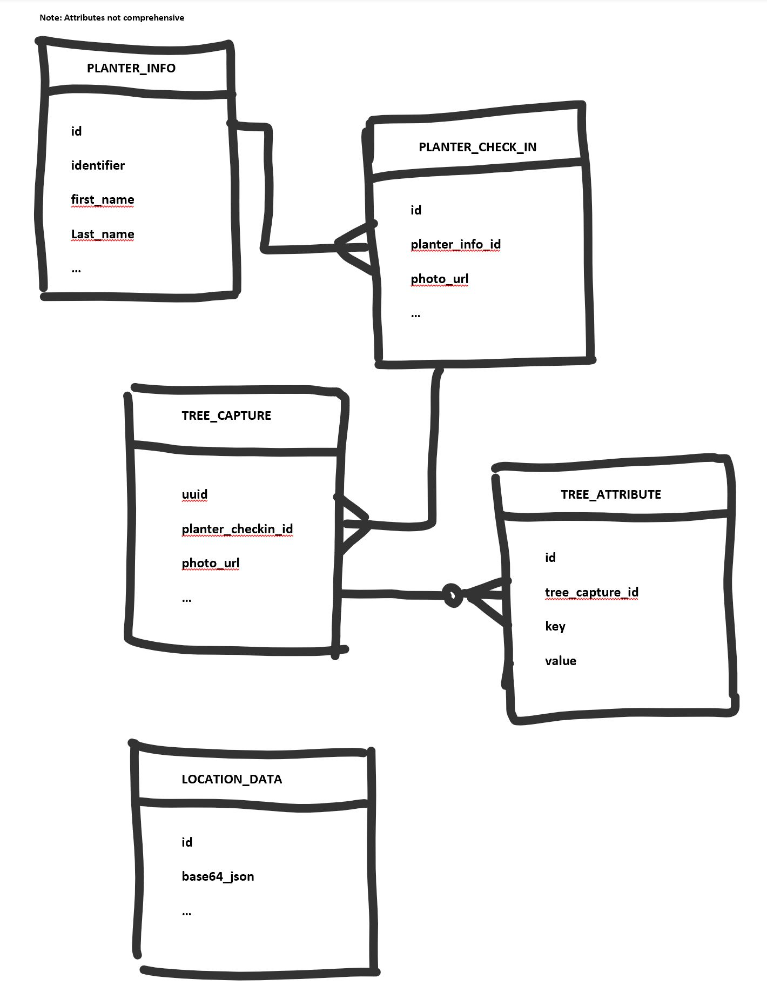

# Data Entities

This page consolidates legacy `Data-Entities` and `Engineering-Documentation` wiki content.

The app uses Room entities for local persistence of planter identity, check-ins, captures, and upload state.

## Entity Model

- `PlanterInfoEntity`: user identity details captured on device
- `PlanterCheckInEntity`: each check-in event with photo and timestamps
- `TreeCaptureEntity`: each tree capture and associated metadata
- `TreeAttributeEntity`: optional per-capture attributes (height, etc.)
- `LocationDataEntity`: additional streamed location context during capture

Entity diagram:

## Core Table Notes

### `planter_info`

Stores profile/identifier information for users known on a device.

Important fields include:

- `_id` (primary key)
- `identifier` (email/phone-based unique identity key in app logic)
- `first_name`, `last_name`, `organization`
- `latitude`, `longitude`
- `uploaded`, `created_at`, `record_uuid`

### `planter_check_in`

Stores each check-in reference for attribution.

Important fields include:

- `_id`
- `planter_info_id` (foreign reference)
- `local_photo_path`
- `latitude`, `longitude`
- `created_at`

### `tree_capture`

Stores each tree tracking activity.

Important fields include:

- `_id`, `uuid`
- `planter_checkin_id`
- `local_photo_path`
- `note_content`
- `latitude`, `longitude`, `accuracy`
- `uploaded`, `created_at`

### `tree_attribute`

Optional key-value attributes per capture.

Important fields include:

- `_id`
- `key`, `value`
- `tree_capture_id`

### `location_data`

Stores base64-encoded location stream data during active capture flow.

Important fields include:

- `_id`
- `base64_json`
- `uploaded`
- `created_at`

For sync orchestration details, see [Data Sync Architecture](data-sync-architecture.md).
